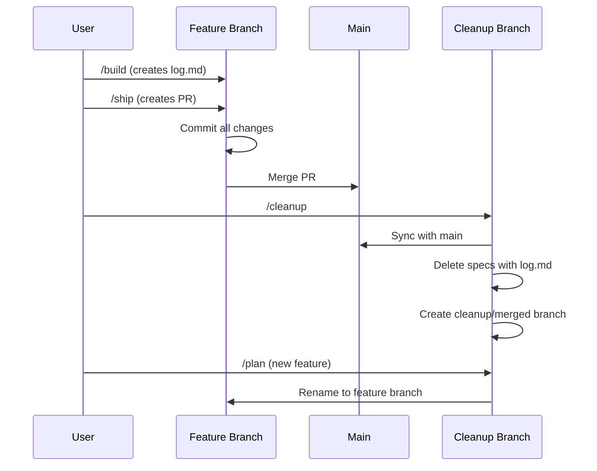

# Specification-Driven Development System

This system combines the best practices from Context Engineering (Cole Medin), 3-File PRD (Ryan Carson), and Linear workflow (Pedram Navid) to create an efficient, AI-friendly development process.

## Quick Start

1. **Create a specification**

   ```bash
   mkdir -p spec/my-feature
   cp spec/template.md spec/my-feature/spec.md
   # Edit spec.md with your requirements
   ```

2. **Generate implementation plan**

   ```
   /plan my-feature
   # or just: /plan (auto-detects if only one spec)
   ```

3. **Build the feature**

   ```
   /build
   # Auto-detects the spec with plan.md
   ```

4. **Validate readiness**

   ```
   /check
   ```

5. **Ship it**
   ```
   /ship
   # Auto-detects the spec ready to ship
   ```

## Directory Structure

```
spec/
├── README.md          # This file
├── template.md        # Specification template
├── stack.md           # Validation commands for your tech stack
├── auth/              # Flat organization
│   ├── spec.md
│   ├── plan.md
│   └── log.md
├── frontend/          # Nested by layer
│   ├── dashboard/
│   │   ├── spec.md
│   │   └── plan.md
│   └── settings/
│       └── spec.md
├── team-a/            # Nested by team
│   └── feature-x/
│       └── spec.md
├── backlog/           # Optional: Future specs not ready to work on
│   └── onboarding-bootstrap/
│       └── spec.md
```

**Note**: Organize specs however makes sense for your project. The system supports arbitrary nesting after `spec/`.

**Optional**: Use `spec/backlog/` for future specs that aren't ready to work on yet. Move them to `spec/` when ready to `/plan`.

**Note**: The slash commands (`/plan`, `/build`, `/check`, `/ship`, `/spec`) are installed globally in Claude's commands directory, not in your project.

## Philosophy

This system is built on three core principles:

1. **Context is King** - Provide comprehensive context to enable autonomous execution
2. **Progressive Validation** - Validate continuously, fix immediately
3. **Clear Workflow** - Separate planning from execution for better results

## Workflow Overview

### 1. Specification (Human writes)

Define WHAT needs to be built, not HOW. Include:

- Clear outcome and success criteria
- Examples and references
- Constraints and context

### 2. Planning (AI generates)

AI analyzes the spec and creates detailed implementation plan:

- Task breakdown
- Risk assessment
- Validation steps

### 3. Building (AI executes)

AI implements based on plan with:

- Continuous validation
- Progress tracking
- Error recovery

### 4. Shipping (AI completes)

Final validation and PR preparation:

- Comprehensive checks
- Documentation updates
- Clean git history

## Command Reference

| Command  | Purpose                          | Notes                                     |
| -------- | -------------------------------- | ----------------------------------------- |
| `/plan`  | Generate implementation plan     | Auto-detects spec or accepts fragment     |
| `/build` | Execute implementation           | Validates continuously; full suite at end |
| `/check` | Validate PR readiness (optional) | /ship runs this automatically             |
| `/ship`  | Complete and ship                | Creates PR; runs /check first             |

## Feature Lifecycle & Cleanup Workflow

### Linear History Workflow

CSW uses **rebase workflow** (linear history), not merge commits.

**When you run `/ship`**:

1. Creates PR from feature branch
2. Commits and pushes to remote
3. PR is ready for review and merge

**When you run `/cleanup` (after PR is merged)**:

1. Syncs with main branch
2. Deletes merged feature branches
3. Creates `cleanup/merged` staging branch
4. **DELETES** spec directories that have `log.md` (proof of completion)
5. Commits the cleanup

**When you run `/plan` (next feature)**:

1. Detects `cleanup/merged` branch and renames it to new feature name
2. Or creates new feature branch from main
3. Ready to start next feature

### Cleanup = DELETE

The `/cleanup` command deletes shipped specs from your working tree:

1. Finds all spec directories with `log.md` files
2. **DELETES** those spec directories (`spec/feature-name/`)
3. Commits the deletion on `cleanup/merged` branch

**Truth**: If a spec has `log.md`, it means `/build` succeeded and the feature is complete.

**Source of record**: Use `gh pr list --state merged` to see shipped features. GitHub PRs are the canonical source of truth.

**Important**: There is no `spec/archive/` directory. Specs are deleted from working tree but preserved in git history.

### Workflow Diagram



### Path Simplification

Paths simplified from `spec/active/feature/` to `spec/feature/`:

- Old: `spec/active/authentication/spec.md`
- New: `spec/authentication/spec.md`

**Rationale**: "active" is redundant because we DELETE specs when done (they're always active).

### Arbitrary Nesting

After `spec/`, organize however you want:

- **Flat**: `spec/auth/`, `spec/dashboard/`
- **By layer**: `spec/frontend/auth/`, `spec/backend/users/`
- **By team**: `spec/team-a/feature-x/`, `spec/team-b/feature-y/`

**Feature identity** = full relative path under spec/:

- `spec/auth/` → feature: `"auth"`
- `spec/frontend/auth/` → feature: `"frontend/auth"`
- `spec/team-a/feature-x/` → feature: `"team-a/feature-x"`

### Smart Path Resolution

Commands accept fragments, not full paths:

**Zero arguments** (auto-detect):

```bash
/plan          # Auto-detects if only 1 spec exists
/build         # Auto-detects if only 1 plan exists
```

**Fragment matching** (Claude fuzzy matches):

```bash
/plan auth                    # Matches spec/auth/ or spec/frontend/auth/
/plan frontend                # Matches spec/frontend/auth/
/plan authentication          # Typo-tolerant, matches "auth"
```

**How it works** (separation of concerns):

1. **Bash layer**: Runs `find spec/ -name "spec.md"`, returns ALL matches
2. **Claude layer**: Fuzzy matches your fragment, handles disambiguation

**Command-specific filtering**:

- `/plan` → Looks for `spec.md` files (specs ready to plan)
- `/build` → Looks for `plan.md` files (specs ready to build)
- `/ship` → Looks for `plan.md` files (specs ready to ship)

**Interactive disambiguation**: Multiple matches show numbered list:

```
I found 2 specs matching "auth":
  1. frontend/auth
  2. backend/auth
Which one?
```

You can respond with: `1`, `frontend`, or `the frontend one`.

### Zero-Arg Sequential Workflow

Solo development with single feature needs zero path arguments:

```bash
/spec my-feature      # Create spec/my-feature/
/plan                 # Auto-detect (only 1 spec)
/build                # Auto-detect (only 1 plan)
/ship                 # Auto-detect (only 1 plan)
# Merge PR
/plan next-feature    # Cleans up my-feature, creates next-feature
```

## Best Practices

### DO:

- ✅ Write clear, specific requirements
- ✅ Include examples from the codebase
- ✅ Reference documentation
- ✅ Define validation criteria
- ✅ Use semantic commit messages

### DON'T:

- ❌ Mix multiple features in one spec
- ❌ Skip validation steps
- ❌ Ignore failing tests
- ❌ Ship without running /check
- ❌ Leave console.logs in code

## Validation Standards

All features must pass validation commands defined in `spec/stack.md`:

- **Lint** - No linting errors
- **Typecheck** - No type errors (if applicable to your stack)
- **Test** - All tests passing
- **Build** - Successful build

The specific commands depend on your tech stack. See `spec/stack.md` for your project's validation commands.

## Git Workflow

1. Features are developed on `feature/{name}` branches
2. Linear history via rebase workflow (no merge commits)
3. Each feature gets semantic commits
4. Specs are cleaned up after merge (preserved in git history)
5. Clean history with meaningful commit messages

## Troubleshooting

**Build fails validation?**

- Check log.md for specific errors
- Fix the code, not the tests
- Re-run validation

**Can't ship?**

- Run `/check` for detailed report
- Fix all critical issues
- Try again

**Lost context?**

- Check log.md for progress
- Plan.md has the full strategy
- Resume from last completed task
